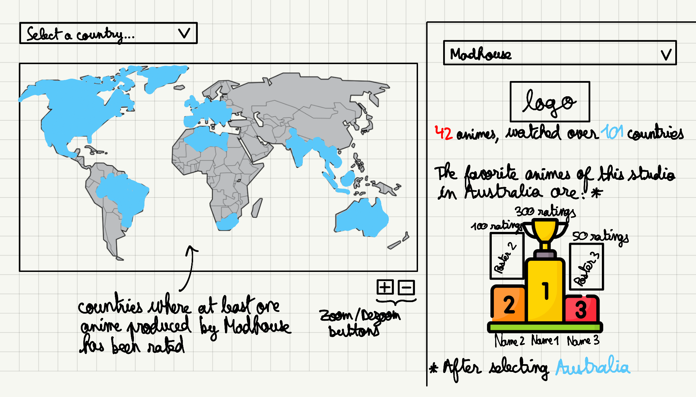

# Milestone 2 (7th May, 5pm)

**10% of the final grade**

The general layout of the website consists of a single-page divided into four main sections that can be accessed by scrolling between them. Each section comprises one or more visualizations, along with some text explaining the content. The header of the website will present general information and statistics about the MyAnimeList (MAL) dataset and will explain the general goal.

## Visualization 1: Circle packing
To visualize the evolution of trends in anime over time for each country, we will be using a **circle packing** data visualization, where the outer circles represent the years and the inner circles the countries. 
Clicking on an outer circle will allow to zoom in on a particular year, then hovering the mouse over a country will reveal its name next to the cursor. When zoomed in, a panel on the right-hand side will display some information on the trends in animes for this year (sketch 1):

- The percentage of ratings for that year relative to the overall number of ratings in the dataset. Year circles are scaled according to this number
- The difference (in percentage point) of this percentage compared to the previous year. For instance, if the ratings done in 2017 represented 20% of the dataset, and the ones done in 2018 represented 22%, the percentage point displayed for the year 2018 is +2. The goal of the two last points is to clearly visualize the growing popularity of animes over the years.
- A **bar chart** showcasing the top 5 animes with the highest number of ratings for the selected year is displayed. Each of the five bars corresponds to an anime and is scaled according to the percentage of total ratings that it represents. This enables the user to identify the most popular animes for that particular year.
Additionally, you can compare these numbers with the ones of a particular country for this year, by selecting the corresponding bubble. This adds a second bar to each group of the resulting **grouped bar chart**. You can compare up to two countries by selecting another bubble, which results in three bars per group. The grouped bar chart will change dynamically depending on the selected circles.

Tools used : D3.js library, Bootstrap library to separate the screen in two divs, as well as Lectures 4,5 and 10.

## Visualization 2: Word Cloud
To visualize the diversity in characters, we will use a **word cloud** of all the tags/traits an anime character can have, e.g., “Adult”, “Teenager”, “Animal”, “Teacher”, “Athlete”.

- Each tag is scaled according to the percentage of characters in the dataset that are described by this tag, and hovering over a tag displays this percentage.
- A search bar will allow to search for a character and each of its tags will be highlighted.
- Tools used: We will rely exclusively on D3.js and the [d3-cloud](https://github.com/jasondavies/d3-cloud) plugin built by Jason Davies. We will also draw inspiration from the examples shown on Lecture 9 “Text visualization”.

## Visualization 3: World Map
To visualize the general specificities and sensibilities of each country, we want to design an interactive **choropleth world map** where each country is colored according to its number of users on MAL. 

When selecting a given country with the mouse (sketch 1), an information panel at the right shows some graphs representing a particular statistic about this country: 
- the three most popular animes (in terms of the number of ratings)
- the most popular studios (in terms of the aggregate number of ratings of the animes of the studio)
- gender balance (Female/Male/Non-binary)
- the distribution of ages
- the average number of days spent watching animes and its rank among the other countries

Above the map, a selector will help picking a country of our choice, if the user wants to avoid having to find the location on the map. 

If no country is currently selected, the default view of the information panel will display a list of the animation studios whose anime are watched in the largest number of countries. A selector positioned above the list enables the user to choose a specific studio from the complete list of all studios. 
Upon selecting a studio (sketch 2), all the countries that have watched at least one anime produced by that studio are highlighted (here in blue). By clicking on a country, the most rated anime of this studio in this country are displayed.

Tools used: We wanted to use the [Leaflet](https://leafletjs.com) library that offers many tools to design interactive maps in JS. In the end we decided to write the interactions with D3.js with the help of Chapter 14 of *[Interactive Data Visualization for the Web](https://www.oreilly.com/library/view/interactive-data-visualization/9781491921296/)*, as adapting the library tools to our needs turned out to be impractical. We also use ideas of interactions that were presented in Lectures 8.1 “Maps” and 8.2 “Practical maps”.

## Visualization 4: Genres Interactive Pie Charts
We are also interested in analyzing the distribution of genres in animes and identify whether certain genres, such as “Comedy” or “Slice of Life”, overlap with each other in general. 

The **pie chart** in sketch 1 shows the distribution of the most prevalent anime genres. Hovering the mouse over a segment of the pie chart reveals the corresponding genre and the percentage of animes in MAL that fall under that particular category (sketch 2). 

Clicking on this segment displays a new pie chart that represents the distribution of genres in the subset of animes that belong to the previously selected genre. For instance among the “Comedy” animes, 33% are of the genre “Slice of Life” (sketch 3).
Similarly, clicking on a segment of the second pie chart displays a third chart representing the distribution of genres of the animes who have the two genres selected in the first and second pie charts, e.g., “Comedy” and “Slice of Life” (sketch 4)

Finally, clicking on one of the genres in the final pie chart reveals a list of the most rated animes of the three selected genres (sketch 5), e.g., “Comedy”, “Slice of Life”, and “School”. The arrow at the bottom right of the graph allows us to go back to the precedent sketch. 

Tools: For these interactive visualizations we will rely exclusively on the D3.js library. We also reuse some ideas given in Lecture 6.1 “Perception colors”, in particular the [iWantHue](https://medialab.github.io/iwanthue/) tool.

## Extra ideas
An extra challenging idea that we might implement is to make a small **anime recommender**, which would incorporate the code of the project from the course [CS-460 "Systems for data management and data science"](https://edu.epfl.ch/coursebook/en/systems-for-data-management-and-data-science-CS-460). The visualization would present to the user the poster of animes that are popular in its country and ask it to rate 10 of them to have a user rating scale. Then, the user writes some information, e.g., its gender and age, and a list of genres that it is interested in. Based on this information, the recommender displays the animes that best fit the user characteristics.